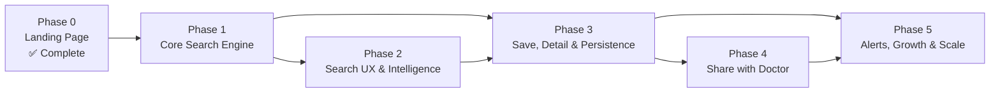

# FindMyTrial — Multiphase Development Plan

> **Derived from**: [idea.md](./idea.md) · [requirements.md](./requirements.md) · [tech-specification.md](./tech-specification.md)  
> **Last Updated**: 2026-06-09

---

## Phases at a Glance

```
 PHASE 0                PHASE 1                PHASE 2               PHASE 3                PHASE 4                PHASE 5
 Landing Page           Core Search            Search UX &           Save, Detail &         Share with             Alerts,
 ✅ COMPLETE            Engine                 Intelligence          Persistence            Doctor                 Growth & Scale
─────────────── ───────────────────── ───────────────────── ───────────────────── ───────────────────── ─────────────────────
 • Hero + search bar    • Wire search to       • Improved NLP        • Save/bookmark        • Shareable summary    • Email alerts
 • Animated headline      real results           (synonym mapping)     trials (localStorage)  links                  for new trials
 • Gradient background  • nctId passthrough    • Example queries     • Saved trials page    • PDF generation       • Backend database
 • Trust pills          • Phase humanization     (clickable)           (/saved)             • Share via email       • Cron jobs
 • How It Works         • Duration calc        • Location filtering  • Trial detail page   • Public share page    • User accounts
 • Sample trials        • Compensation detect  • "No results" UX       (/trial/[nctId])     (/share/[shareId])     (optional)
 • Testimonials         • Learn More → link    • Pagination          • Search history       • Doctor-friendly      • Analytics
 • FAQ                  • Input validation       (Load More)         • Loading skeletons      formatting             dashboard
 • Final CTA           • Error handling        • Field selection     • Error boundaries     • QR code for          • Multi-language
 • Footer              • Retry w/ backoff        optimization        • Shared code package    print summaries      • SEO + PWA
 • Responsive design   • pageSize → 10        • Debounced input     • Toast notifications                         • Rate limit proxy
 • Scroll animations                                                                                               • Monitoring
                                                         
 ✅ Done                ~16 hours               ~14 hours             ~23 hours              ~20 hours              ~30 hours
```

---

## Phase Overview

| Phase | Name | Status | Focus | Key Outcome |
|-------|------|--------|-------|-------------|
| **0** | Landing Page | ✅ **Complete** | First impression — brand, design, storytelling | A beautiful, animated landing page that communicates the product vision |
| **1** | Core Search Engine | 🔲 Not Started | Make search actually work end-to-end | Users can search and see real, useful trial results with complete data |
| **2** | Search UX & Intelligence | 🔲 Not Started | Smarter queries, better results | Natural language actually feels natural — synonyms, location, pagination |
| **3** | Save, Detail & Persistence | 🔲 Not Started | Let users go deeper and come back | Users can save trials, view full details, and revisit their search history |
| **4** | Share with Doctor | 🔲 Not Started | Close the loop — patient → physician | Users can generate and share professional trial summaries with their doctor |
| **5** | Alerts, Growth & Scale | 🔲 Not Started | Automated matching + infrastructure maturity | Proactive notifications, user accounts, observability, internationalization |

---

## Phase Dependency Chain



> **Note**: Phase 2 and Phase 3 have some parallelism — pagination (Phase 2) and save functionality (Phase 3) are independent. But the trial detail page (Phase 3) benefits from improved search quality (Phase 2), so sequential is recommended.

---

---

# Phase 0 — Landing Page ✅ COMPLETE

> **Goal**: Create a stunning first impression that communicates what FindMyTrial does, builds trust, and invites users to search.

### What's Built

| Component | File | Description | Status |
|-----------|------|-------------|--------|
| **Root Layout** | `frontend/app/layout.tsx` | Inter + Playfair Display fonts, metadata, OG tags | ✅ |
| **Home Page** | `frontend/app/page.tsx` | Single-page app with state management for search | ✅ |
| **Global Styles** | `frontend/app/globals.css` | CSS variables, 10+ custom keyframe animations | ✅ |
| **Navbar** | `frontend/components/Navbar.tsx` | Fixed nav, scroll-triggered backdrop blur, mobile hamburger, anchor links | ✅ |
| **Hero** | `frontend/components/Hero.tsx` | Animated gradient background, "Live data" badge with pulse dot, staggered headline animation, search bar + submit, CountUpNumber trust pills | ✅ |
| **Search Results** | `frontend/components/SearchResults.tsx` | Loading / empty / grid states — container for TrialCards | ✅ |
| **Trial Card** | `frontend/components/TrialCard.tsx` | Status badge, title, condition/phase tags, summary, details grid, hover lift | ✅ |
| **How It Works** | `frontend/components/HowItWorks.tsx` | 3-step explainer, desktop horizontal / mobile vertical timeline, animated dashed connector | ✅ |
| **Sample Trials** | `frontend/components/SampleTrials.tsx` | 3 hardcoded example trials (Lupus, MS, Lung Cancer) | ✅ |
| **Testimonials** | `frontend/components/Testimonials.tsx` | 3 testimonials, directional entrance animations, hover accents | ✅ |
| **FAQ** | `frontend/components/FAQ.tsx` | 6 questions, custom accordion with CSS grid animation | ✅ |
| **Final CTA** | `frontend/components/FinalCTA.tsx` | Navy background, word-by-word stagger animation, pulsing amber CTA | ✅ |
| **Footer** | `frontend/components/Footer.tsx` | Brand, links, medical disclaimer | ✅ |
| **Scroll Animation Hook** | `frontend/hooks/use-scroll-animation.ts` | IntersectionObserver-based one-time entrance trigger | ✅ |
| **API Route** | `frontend/app/api/search/route.ts` | Basic search → ClinicalTrials.gov (stop-word removal, 5 results) | ✅ (basic) |
| **Backend Server** | `backend/src/` | Express.js mirror of frontend API route (optional) | ✅ |

### Design System Established

| Token | Value | Usage |
|-------|-------|-------|
| `ivory` | `#FAF7F2` | Background |
| `navy` | `#0F1F3D` | Text, dark sections |
| `amber` | `#C8922A` | Accent, CTAs |
| `slate` | `#5A6475` | Secondary text |
| `warm-gray` | `#E8E2D9` | Borders |
| Inter | Sans-serif | Body |
| Playfair Display | Serif | Headings |

### What's NOT in Phase 0

- ❌ No sign-up / sign-in / authentication
- ❌ No user accounts
- ❌ "Learn More" and "Save Trial" buttons are non-functional (wired in later phases)
- ❌ Search works but returns incomplete data (no duration, no compensation, no nctId, no ClinicalTrials.gov link)

---

---

# Phase 1 — Core Search Engine

> **Goal**: Make search actually work end-to-end — a user types a condition, and every trial card displays complete, accurate, useful information with real links.

### Why This Phase

Phase 0 built the *shell*. The search bar exists, the cards render, the API route fires. But the results are incomplete — there's no nctId (so nothing can link anywhere), duration and compensation are always blank, phases aren't translated to plain English, "Learn More" goes nowhere, and only 5 results come back. This phase fills every gap so that the core search → display loop is genuinely useful.

### Deliverables

| # | Task | Requirement | Files Modified | Details |
|---|------|-------------|---------------|---------|
| 1.1 | **Add `nctId` to TrialData** | Blocker for FR-14, FR-15 | `route.ts`, `search.ts`, `TrialCard.tsx`, `types/index.ts` | Extract `identificationModule.nctId` from API response and include in every TrialData object. This unblocks linking, saving, and sharing. |
| 1.2 | **Wire "Learn More" button** | FR-14 | `TrialCard.tsx` | Change from `<button>` to `<a href="https://clinicaltrials.gov/study/${nctId}" target="_blank">`. Opens official trial page in new tab. |
| 1.3 | **Phase humanization** | FR-12 | `route.ts`, `search.ts` | Map API phase codes to plain English. `PHASE1` → "Phase 1 · Testing safety and dosage", `PHASE2` → "Phase 2 · Testing effectiveness", etc. |
| 1.4 | **Duration calculation** | FR-11 | `route.ts`, `search.ts` | Calculate from `startDateStruct.date` and `completionDateStruct.date`. Display as "~18 months" or "~2 years, 3 months". Falls back to "Duration not specified". |
| 1.5 | **Compensation detection** | FR-11 | `route.ts`, `search.ts` | Regex scan of `briefSummary`, `detailedDescription`, and `eligibilityCriteria` for keywords: `compensat`, `reimburse`, `stipend`, `payment`, `\$\d`. Returns "Compensation may be available" or "Not specified — contact study team". |
| 1.6 | **Increase pageSize to 10** | — | `route.ts`, `search.ts` | Change hardcoded `pageSize=5` to `pageSize=10`. |
| 1.7 | **Input validation** | — | `route.ts`, `Hero.tsx` | Frontend: prevent submission if query < 3 characters, show inline hint. Backend: return 400 with message if query is empty/too short. Sanitize HTML/script tags. |
| 1.8 | **Error handling & retry** | — | `route.ts` | Add `fetchWithRetry()` wrapper: 10s timeout, retry on 429 (respect `Retry-After`) and 5xx (exponential backoff, max 2 retries). Map all errors to user-friendly messages. |
| 1.9 | **Loading state improvements** | — | `SearchResults.tsx` | Replace "Searching..." text with a shimmer skeleton (3 placeholder cards with animated gradient). |

### Acceptance Criteria

| Scenario | Expected Result |
|----------|----------------|
| Search "lupus" | 10 results returned, each with title, status badge, conditions, phase in plain English, summary, location, duration, age range, compensation |
| Click "Learn More" on any result | Opens `https://clinicaltrials.gov/study/NCT{id}` in a new tab |
| Search with empty input | Submit button disabled, inline hint: "Describe your condition in a few words" |
| ClinicalTrials.gov API is down | Friendly error message displayed, no crash |
| Search "xyznonexistent123" | Shows "no results" state (currently implemented) |

### Estimated Effort: ~16 hours

---

---

# Phase 2 — Search UX & Intelligence

> **Goal**: Make natural language search actually feel natural — smarter queries, location filtering, pagination, and a polished discovery experience.

### Why This Phase

Phase 1 made the data complete. Phase 2 makes the *search itself* intelligent. Currently, "I have stage 2 lupus and treatment stopped working" produces `stage+lupus` — dropping the stage number, the treatment context, and any location. This phase fixes that and adds the UX patterns (pagination, example queries, no-results guidance) that turn a functional search into a *good* search.

### Deliverables

| # | Task | Requirement | Files Modified | Details |
|---|------|-------------|---------------|---------|
| 2.1 | **Improved NLP: synonym mapping** | FR-2 | `route.ts`, `search-helpers.ts` | Build a `parseNaturalLanguage()` function that: (a) identifies the primary condition → `query.cond`, (b) preserves compound modifiers like "stage 2", "type 1", "triple negative", (c) maps patient language to clinical terms ("stopped working" → "refractory", "came back" → "recurrent", "spread" → "metastatic"). |
| 2.2 | **Example queries (clickable)** | FR-4 | `Hero.tsx` | Display 4–5 clickable example queries below the search bar: "Stage 2 lupus", "Triple negative breast cancer", "Type 1 diabetes in children", "Chronic migraine", "Early Parkinson's near Houston". Clicking populates the search bar and triggers a search. |
| 2.3 | **Location filtering** | FR-7 | `Hero.tsx`, `route.ts`, `SearchResults.tsx` | Add a secondary input field (or auto-extract from query) for city/state/zip. Pass as `query.locn` to the ClinicalTrials.gov API. Extract embedded location from query text (regex for "near X", "in X", "around X"). |
| 2.4 | **"No results" guidance** | FR-10 | `SearchResults.tsx` | When results are empty, show a friendly panel: "We didn't find recruiting trials matching your exact description." + 3 suggestions: (1) Try just the condition name, (2) Remove stage/type qualifiers, (3) Broaden your location. Include clickable modified query suggestions. |
| 2.5 | **Pagination (Load More)** | FR-9 | `route.ts`, `page.tsx`, `SearchResults.tsx` | Return `nextPageToken` from API response. Add "Load More Results" button at bottom of results grid. Clicking fetches next page and appends to existing results array. Track total loaded count. |
| 2.6 | **Field selection optimization** | — | `route.ts` | Add `fields` parameter to ClinicalTrials.gov API request — only request the ~20 fields we actually use. Reduces response payload by ~70%. |
| 2.7 | **Debounced search suggestions** | — | `Hero.tsx` | As user types (after 300ms debounce + 5 char minimum), show a subtle "Press Enter to search for [extracted terms]" preview below input. Helps users understand how their input will be interpreted. |

### Architecture Changes

```
BEFORE (Phase 1):
  User input → extractSearchTerms() → query.term → API

AFTER (Phase 2):
  User input → parseNaturalLanguage() → ParsedIntent
    ├─ intent.condition     → query.cond    (e.g., "lupus")
    ├─ intent.modifiers     → query.term    (e.g., "stage 2 refractory")
    ├─ intent.synonyms      → query.term    (appended)
    └─ intent.location      → query.locn    (e.g., "Houston, TX")
```

### Synonym Mapping Table

| Patient Says | Maps To | Why |
|-------------|---------|-----|
| "stopped working" | refractory, treatment-resistant | Common patient phrasing for failed treatment |
| "came back" / "returned" | recurrent, relapsed | Cancer/autoimmune relapse language |
| "spread" | metastatic | Cancer metastasis in lay terms |
| "early stage" | stage I, stage II | Catch-all for non-specific staging |
| "advanced" / "late stage" | advanced, late-stage, stage III, stage IV | Aggressive disease language |
| "kids" / "children" | pediatric | Age group terminology |
| "new treatment" / "experimental" | investigational | Drug development terminology |
| "nothing works" / "tried everything" | refractory, treatment-resistant | Desperation language common in patients |

### Acceptance Criteria

| Scenario | Expected Result |
|----------|----------------|
| Search "stage 2 lupus treatment stopped working" | API receives `query.cond=lupus` and `query.term=stage 2 refractory treatment-resistant` |
| Search "breast cancer near Houston" | Results filtered by `query.locn=Houston` |
| Click example query "Chronic migraine" | Search bar populates and search fires immediately |
| 10 results shown, more available | "Load More Results" button visible; clicking loads 10 more and appends |
| Search "xyzabc123" (no results) | Friendly guidance panel with 3 actionable suggestions |

### Estimated Effort: ~14 hours

---

---

# Phase 3 — Save, Detail & Persistence

> **Goal**: Let users go deeper into individual trials, save the ones they care about, and come back later — all without creating an account.

### Why This Phase

Phases 1–2 built a great search experience, but it's stateless. Users find trials, read a summary card, and then… what? They can't save anything, they can't see the full picture, and if they close the tab it's all gone. This phase adds the *persistence layer* — saving via localStorage, a full trial detail page, and search history — turning FindMyTrial from a search tool into a personal trial tracking companion.

### Deliverables

| # | Task | Requirement | Files Modified | Details |
|---|------|-------------|---------------|---------|
| 3.1 | **`useSavedTrials` hook** | FR-15–17 | `hooks/use-saved-trials.ts` (new) | Custom hook wrapping localStorage. Provides `save()`, `remove()`, `isSaved()`, `savedTrials[]`. Max 50 saved trials. Syncs across tabs via `storage` event listener. |
| 3.2 | **Wire "Save Trial" button** | FR-15 | `TrialCard.tsx` | Toggle save/unsave with visual feedback. Saved state shown as filled bookmark icon + "Saved" label. Toast notification on save/remove. |
| 3.3 | **Saved Trials page (`/saved`)** | FR-18 | `app/saved/page.tsx` (new) | Grid of saved TrialCards with remove button. Empty state: "You haven't saved any trials yet. Start searching to find trials worth keeping." Sort by saved date (newest first). Count badge in Navbar. |
| 3.4 | **Trial detail page (`/trial/[nctId]`)** | — | `app/trial/[nctId]/page.tsx` (new), `app/api/trial/route.ts` (new) | Full-page trial breakdown fetched via `GET /api/v2/studies/{nctId}`. Sections: What's Being Tested (interventions), Who Can Participate (eligibility in plain English), What Participation Involves (arms/groups), Locations (all sites, not just first), Timeline, Sponsor, Contact Info. Link to ClinicalTrials.gov. Save button. |
| 3.5 | **Search history** | — | `hooks/use-search-history.ts` (new), `Hero.tsx` | Store last 10 searches in localStorage. Show as a dropdown under the search bar when focused (if history exists). Click to re-run search. "Clear history" link. |
| 3.6 | **Loading skeleton UI** | — | `components/TrialCardSkeleton.tsx` (new), `SearchResults.tsx` | Animated shimmer skeletons matching TrialCard layout. Show 3 skeletons during search. |
| 3.7 | **React error boundary** | — | `components/ErrorBoundary.tsx` (new), `layout.tsx` | Catches render errors, shows friendly "Something went wrong" message with "Try again" button. Logs error details to console. |
| 3.8 | **Shared code package** | Tech debt | `shared/` (new package) | Extract duplicated types (`TrialData`, `StudyProtocolSection`) and utilities (`extractSearchTerms`, `simplifySummary`, `calculateDuration`) into a shared internal package. Both frontend and backend import from `shared/`. |
| 3.9 | **Navbar updates** | — | `Navbar.tsx` | Add "Saved Trials" link with count badge (number of saved trials). Show badge only when count > 0. |
| 3.10 | **Toast notifications** | — | Wire existing `use-toast.ts` | Enable the already-installed shadcn/ui toast system. Use for: "Trial saved!", "Trial removed", error messages, "Copied to clipboard". |

### New Routes

| Route | Component | Data Source |
|-------|-----------|-------------|
| `/saved` | `app/saved/page.tsx` | localStorage (`findmytrial_saved`) |
| `/trial/[nctId]` | `app/trial/[nctId]/page.tsx` | ClinicalTrials.gov API `GET /studies/{nctId}` |

### localStorage Schema

```typescript
// findmytrial_saved — Saved trials
[
  {
    "nctId": "NCT04852770",
    "trial": { /* full TrialData object */ },
    "savedAt": "2026-06-09T15:00:00Z",
    "notes": ""
  }
]

// findmytrial_history — Recent searches
[
  { "query": "stage 2 lupus", "timestamp": "2026-06-09T15:00:00Z" },
  { "query": "breast cancer near Houston", "timestamp": "2026-06-09T14:30:00Z" }
]
```

### Trial Detail Page Layout

```
┌────────────────────────────────────────────────────────────────┐
│  ← Back to results                              [Save Trial]  │
│                                                                │
│  NCT04852770                                                   │
│  ──────────────────────────────────────────────────             │
│  Trial Title in Full                                           │
│  Phase 2 · Recruiting · Sponsor: Genentech                     │
│                                                                │
│  ┌──────────────────────────────────────────────────────────┐  │
│  │  WHAT'S BEING TESTED                                     │  │
│  │  Researchers are testing Belimumab (a monoclonal          │  │
│  │  antibody) to see if it reduces lupus flares in           │  │
│  │  patients who haven't responded to standard treatment.    │  │
│  └──────────────────────────────────────────────────────────┘  │
│                                                                │
│  ┌──────────────────────────────────────────────────────────┐  │
│  │  WHO CAN PARTICIPATE                                     │  │
│  │  • Ages 18–65                                            │  │
│  │  • All sexes eligible                                    │  │
│  │  • Must have diagnosed SLE (Systemic Lupus)              │  │
│  │  • Must have tried at least one standard treatment       │  │
│  │                                                          │  │
│  │  Full eligibility criteria ▼ (expandable)                │  │
│  └──────────────────────────────────────────────────────────┘  │
│                                                                │
│  ┌──────────────────────────────────────────────────────────┐  │
│  │  LOCATIONS (4 sites recruiting)                          │  │
│  │                                                          │  │
│  │  📍 Massachusetts General Hospital — Boston, MA          │  │
│  │  📍 Johns Hopkins University — Baltimore, MD             │  │
│  │  📍 Stanford Medical Center — Palo Alto, CA              │  │
│  │  📍 Mayo Clinic — Rochester, MN                          │  │
│  └──────────────────────────────────────────────────────────┘  │
│                                                                │
│  ┌─────────────┬─────────────┬──────────────┬──────────────┐  │
│  │ ⏱ Duration  │ 👥 Enrolling│ 💰 Comp.     │ 🏥 Type      │  │
│  │ ~18 months  │ 200 people  │ May be avail.│ Interventional│  │
│  └─────────────┴─────────────┴──────────────┴──────────────┘  │
│                                                                │
│  [View on ClinicalTrials.gov]    [Share with Doctor]           │
└────────────────────────────────────────────────────────────────┘
```

### Acceptance Criteria

| Scenario | Expected Result |
|----------|----------------|
| Click "Save Trial" on a card | Button toggles to "Saved" (filled bookmark), toast: "Trial saved!" |
| Navigate to `/saved` | See all saved trials in a grid, sorted newest-first |
| Click a trial card title | Navigate to `/trial/NCTxxxx` with full detail page |
| Close browser, reopen `/saved` | All previously saved trials are still there (localStorage) |
| Focus on search bar with history | Dropdown shows last 10 searches, click to re-run |
| API call fails during search | Error boundary shows friendly message, page doesn't crash |

### Estimated Effort: ~23 hours

---

---

# Phase 4 — Share with Doctor

> **Goal**: Bridge the final gap — let patients share their findings with physicians in a professional, clear format that a doctor can act on.

### Why This Phase

Finding a trial is only half the battle. The other half is discussing it with a doctor. Most patients don't know how to present clinical trial information to their physician, and most doctors don't have time to navigate ClinicalTrials.gov themselves. This phase creates a *professionally formatted, shareable summary* that makes the patient-doctor conversation productive.

### Deliverables

| # | Task | Requirement | Files Modified | Details |
|---|------|-------------|---------------|---------|
| 4.1 | **Share summary API** | FR-22 | `app/api/share/route.ts` (new) | `POST /api/share` accepts `{ trials: TrialData[], patientNote?: string }`. Generates a short UUID (`shareId`), stores the summary (JSON file in Netlify Blob Storage or a lightweight DB), returns `{ shareId, shareUrl }`. Summaries expire after 30 days. |
| 4.2 | **Public share page** | FR-22–23 | `app/share/[shareId]/page.tsx` (new) | Renders the shared trial summary in a clean, print-friendly layout. Includes: patient's note (if any), each trial's plain English summary, eligibility snapshot, locations, ClinicalTrials.gov link. No nav/footer — standalone page optimized for reading. |
| 4.3 | **PDF generation** | FR-22 | `lib/generate-pdf.ts` (new) | Client-side PDF generation using `@react-pdf/renderer` or `jspdf`. Generates a branded PDF with FindMyTrial header, selected trials, and a footer disclaimer. "Download PDF" button on share page and trial detail page. |
| 4.4 | **Share button on TrialCard** | FR-22 | `TrialCard.tsx` | Add share icon button. Opens a modal/dropdown with options: "Copy Link", "Download PDF", "Email to Doctor". |
| 4.5 | **Batch share from saved** | FR-22 | `app/saved/page.tsx` | Multi-select saved trials → "Share Selected" button → generates a combined summary link/PDF with all selected trials. |
| 4.6 | **Email directly to doctor** | FR-24 | `app/api/email/route.ts` (new) | Optional "Email to Doctor" flow: user enters doctor's email + optional message → server sends a formatted HTML email via Resend with the trial summary and link to share page. |
| 4.7 | **Copy link functionality** | — | `TrialCard.tsx`, share page | "Copy Link" button copies `findmytrial.com/share/{shareId}` to clipboard. Toast: "Link copied!" |
| 4.8 | **Print-optimized CSS** | — | `globals.css` | `@media print` styles: hide nav, footer, buttons. Clean black-on-white layout. Proper page breaks between trials. |

### Share Page Layout (Doctor-Facing)

```
┌────────────────────────────────────────────────────────────────┐
│                                                                │
│  🔬 FindMyTrial                                                │
│  Clinical Trial Summary — Prepared for Dr. ___________         │
│                                                                │
│  ┌──────────────────────────────────────────────────────────┐  │
│  │  💬 Patient's Note                                       │  │
│  │  "Hi Dr. Smith, I found these trials for my lupus.       │  │
│  │   Could we discuss them at my next appointment?"         │  │
│  └──────────────────────────────────────────────────────────┘  │
│                                                                │
│  ━━━━━━━━━━━━━━━━━━━━━━━━━━━━━━━━━━━━━━━━━━━━━━━━━━━━━━━━━━  │
│                                                                │
│  TRIAL 1 OF 3 — NCT04852770                                   │
│  Belimumab for Treatment-Resistant Lupus                       │
│  Phase 2 · Recruiting · Genentech                              │
│                                                                │
│  What's being tested: ...                                      │
│  Eligibility: Ages 18–65, all sexes, diagnosed SLE             │
│  Locations: Boston MA, Baltimore MD, Palo Alto CA              │
│  Duration: ~18 months · Compensation: May be available         │
│                                                                │
│  🔗 clinicaltrials.gov/study/NCT04852770                       │
│                                                                │
│  ━━━━━━━━━━━━━━━━━━━━━━━━━━━━━━━━━━━━━━━━━━━━━━━━━━━━━━━━━━  │
│                                                                │
│  TRIAL 2 OF 3 — NCT05123456                                   │
│  ...                                                           │
│                                                                │
│  ──────────────────────────────────────────────────────────── │
│  ⚠️ Disclaimer: FindMyTrial is not a medical provider.         │
│  All data sourced from ClinicalTrials.gov. Always discuss      │
│  clinical trial participation with your physician.             │
│                                                                │
│  [Download PDF]  [Print This Page]                             │
└────────────────────────────────────────────────────────────────┘
```

### Acceptance Criteria

| Scenario | Expected Result |
|----------|----------------|
| Click "Share" on a trial card | Modal with Copy Link / Download PDF / Email options |
| Click "Copy Link" | Share link created, copied to clipboard, toast confirmation |
| Open share link in browser | Clean, professional trial summary with all details |
| Click "Download PDF" | PDF downloaded with branded header, trial summaries, disclaimer |
| Send via email | Doctor receives formatted email with trial summary + share link |
| Share link after 30 days | Expired — shows "This summary has expired" message |

### Estimated Effort: ~20 hours

---

---

# Phase 5 — Alerts, Growth & Scale

> **Goal**: Transform FindMyTrial from a search tool into a proactive matching service — trials come to the patient, not the other way around. Plus: the infrastructure maturity needed to support real users at scale.

### Why This Phase

Phases 1–4 built a complete search → save → share workflow. But it's entirely pull-based: users must come back and search again to find new trials. For patients with rare diseases — where a new trial might appear once every few months — this isn't enough. Phase 5 adds *push-based* notifications: users describe what they're looking for once, and FindMyTrial emails them when new matches appear. This phase also adds the infrastructure (database, monitoring, accounts) to support a growing user base.

### Deliverables

#### 5A — Email Alerts System

| # | Task | Requirement | Details |
|---|------|-------------|---------|
| 5A.1 | **Database setup** | Infra | PostgreSQL (or SQLite for early stage). Tables: `alerts`, `alert_results`, `shared_summaries`. Prisma ORM for type-safe queries. |
| 5A.2 | **Alerts CRUD API** | FR-19–21 | `POST /api/alerts` — create alert (query, location, frequency, email). `GET /api/alerts?email=` — list user's alerts. `DELETE /api/alerts/:id` — remove alert. `PATCH /api/alerts/:id` — update frequency. |
| 5A.3 | **Alerts management page** | FR-21 | `/alerts` page: list active alerts, toggle frequency, delete. Create new alert from any search (button in search results header). |
| 5A.4 | **Alert processing cron** | FR-19 | Background job (daily at 6 AM UTC / weekly on Mondays): for each alert, query ClinicalTrials.gov, compare results against `alert_results` table, identify new trials, send email if new matches found, update `lastCheckedAt`. |
| 5A.5 | **Email notification templates** | FR-19 | Branded HTML email: "We found 3 new trials matching 'stage 2 lupus'". Lists new trials with plain English summaries. Link to FindMyTrial to view full details. Unsubscribe link. |
| 5A.6 | **Email service integration** | FR-19 | Resend API integration (3,000 free emails/month). Transactional emails: alert notifications, email verification, share-with-doctor. |

#### 5B — User Accounts (Optional)

| # | Task | Details |
|---|------|---------|
| 5B.1 | **Email-based auth** | Passwordless magic link authentication. No password management, no OAuth complexity. User enters email → receives magic link → signed in. |
| 5B.2 | **Account-based saved trials** | Migrate from localStorage to database. Sync saved trials across devices. |
| 5B.3 | **Account-based search history** | Persist search history to database. Show personalized "recent searches" across devices. |

#### 5C — Infrastructure & Scale

| # | Task | Details |
|---|------|---------|
| 5C.1 | **Rate limit proxy** | Server-side proxy to ClinicalTrials.gov with request queuing. Prevents 429s from multiple concurrent users. Shared request pool with priority queue. |
| 5C.2 | **Response caching layer** | Redis or in-memory cache for identical queries within a 5-minute window. Reduces API calls and improves response time for popular searches. |
| 5C.3 | **Health monitoring** | Uptime monitoring (e.g., BetterStack). Error tracking (e.g., Sentry). API latency dashboards. Alert on ClinicalTrials.gov downtime. |
| 5C.4 | **Analytics (privacy-respecting)** | Plausible or Umami (privacy-first, no cookies). Track: searches per day, most searched conditions, save rate, share rate. No PII. |
| 5C.5 | **SEO optimization** | Dynamic meta tags per trial detail page. Structured data (JSON-LD) for medical content. Sitemap generation for indexed trial pages. |
| 5C.6 | **PWA support** | Service worker for offline landing page. Add-to-homescreen prompt. Push notifications (complement to email alerts). |

#### 5D — Growth Features

| # | Task | Details |
|---|------|---------|
| 5D.1 | **Multi-language support** | i18n framework (next-intl). Priority: Spanish, French, Mandarin. Translate UI strings + plain English summaries. |
| 5D.2 | **Accessibility audit** | WCAG 2.1 AA audit with axe-core. Fix all violations. Screen reader testing (NVDA, VoiceOver). Keyboard navigation review. |
| 5D.3 | **Dark mode** | System-preference-aware dark theme. Toggle in navbar. Persist preference in localStorage. |
| 5D.4 | **Advanced filters UI** | Filter sidebar/panel: phase checkboxes, age range slider, sex dropdown, study type toggle. Complement natural language with structured filtering. |

### New Infrastructure

```
┌──────────────┐     ┌──────────────────┐     ┌─────────────────┐
│   Browser    │◄───▶│   Netlify CDN    │     │ ClinicalTrials  │
│              │     │  + Serverless    │◄───▶│   .gov API v2   │
└──────────────┘     └────────┬─────────┘     └─────────────────┘
                              │
                              ▼
                     ┌──────────────────┐
                     │  Backend Server  │
                     │  (Express.js)    │
                     │                  │
                     │  ┌────────────┐  │
                     │  │ PostgreSQL │  │
                     │  │ • alerts   │  │
                     │  │ • users    │  │
                     │  │ • saved    │  │
                     │  │ • shares   │  │
                     │  └────────────┘  │
                     │                  │
                     │  ┌────────────┐  │
                     │  │ Cron Jobs  │  │
                     │  │ • daily    │  │
                     │  │   alerts   │  │
                     │  └────────────┘  │
                     │                  │
                     │  ┌────────────┐  │
                     │  │ Resend     │  │
                     │  │ (email)    │  │
                     │  └────────────┘  │
                     │                  │
                     │  ┌────────────┐  │
                     │  │ Redis      │  │
                     │  │ (cache)    │  │
                     │  └────────────┘  │
                     └──────────────────┘
```

### Acceptance Criteria

| Scenario | Expected Result |
|----------|----------------|
| User creates alert for "lupus" (daily) | Alert stored in DB. Next day at 6 AM, cron runs, finds new trials, sends email. |
| User clicks "Unsubscribe" in email | Alert deleted, confirmation page shown |
| 50 concurrent users search simultaneously | Rate limit proxy queues requests, no 429s from ClinicalTrials.gov |
| User visits in Spanish | UI rendered in Spanish, trial summaries translated |
| User enables dark mode | Full dark theme applied, preference persisted |

### Estimated Effort: ~30 hours

---

---

## Summary: Total Estimated Effort

| Phase | Name | Effort | Cumulative |
|-------|------|--------|------------|
| **0** | Landing Page | ✅ Complete | — |
| **1** | Core Search Engine | ~16 hours | 16 hours |
| **2** | Search UX & Intelligence | ~14 hours | 30 hours |
| **3** | Save, Detail & Persistence | ~23 hours | 53 hours |
| **4** | Share with Doctor | ~20 hours | 73 hours |
| **5** | Alerts, Growth & Scale | ~30 hours | 103 hours |

### Key Milestones

| Milestone | After Phase | What Users Can Do |
|-----------|------------|-------------------|
| 🟢 **Usable** | Phase 1 | Search and get complete, real trial results with working links |
| 🟡 **Good** | Phase 2 | Smart search with synonyms, location, pagination — feels polished |
| 🔵 **Sticky** | Phase 3 | Save trials, view details, build a personal list — reasons to come back |
| 🟣 **Actionable** | Phase 4 | Share with doctor, download PDF — turns information into action |
| 🔴 **Platform** | Phase 5 | Automated alerts, accounts, multi-language — a service, not just a tool |

---

*This plan is a living document. Update phase status and estimates as implementation progresses.*
